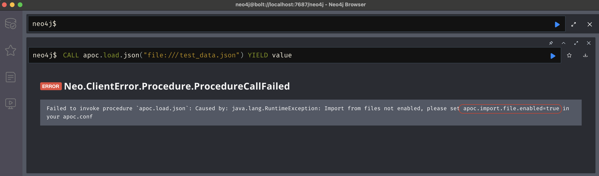
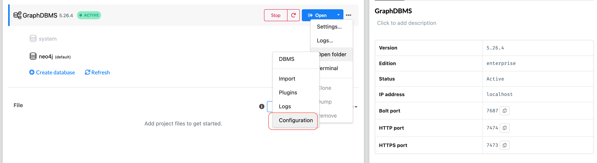
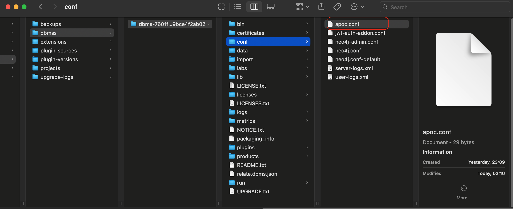
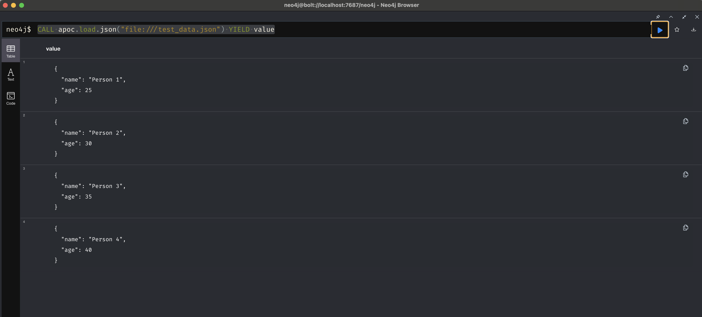

#### APOC Load Json Error 

If we try to execute following command to load a JSON file using APOC

```cypher
CALL apoc.load.json("file:///test_data.json") YIELD value
```
We see the following error:



To resolve this, we need to add in the `conf` directory of the installation directory



Create a file with name `apoc.conf`




The contents of the file will be 

```cypher
apoc.import.file.enabled=true
```

The restart the database

And run the cypher command again

```cypher
CALL apoc.load.json("file:///test_data.json") YIELD value
```

And you will see the output as shown below.


